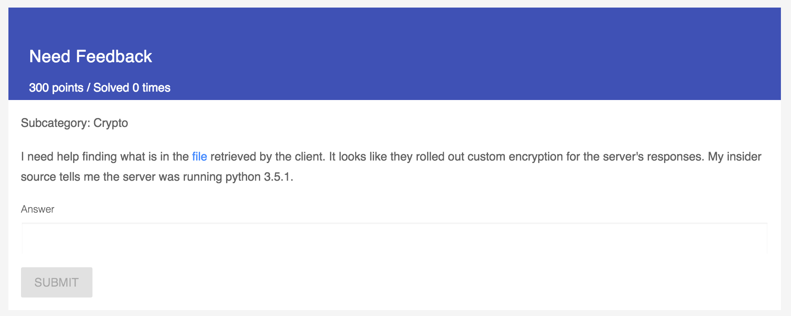
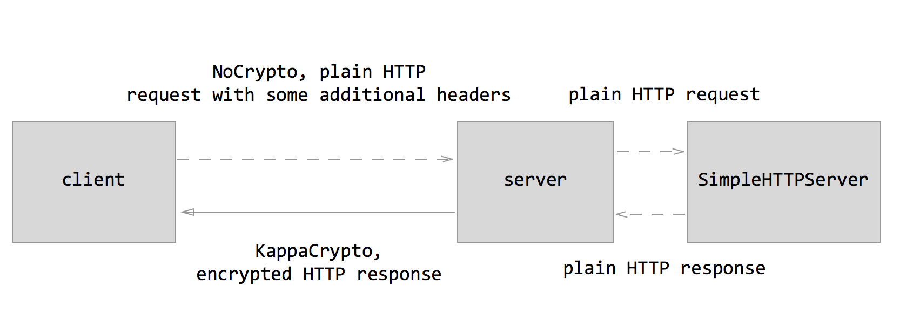
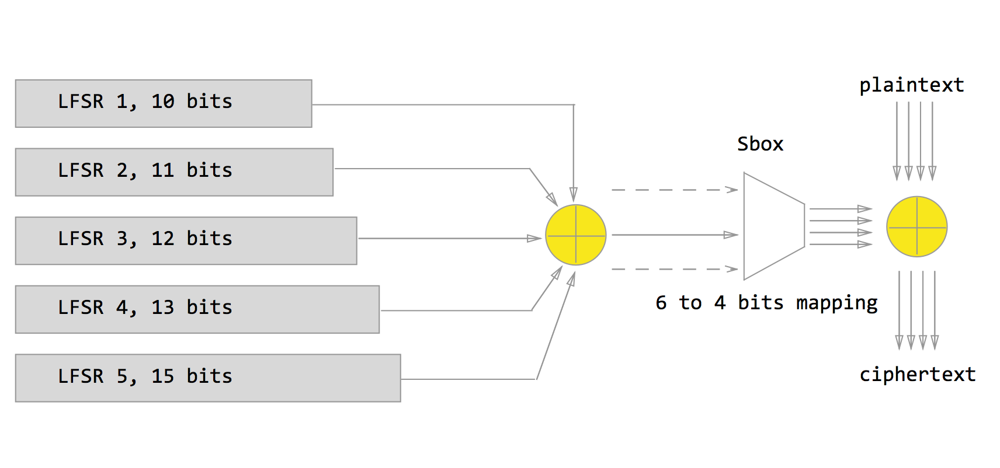
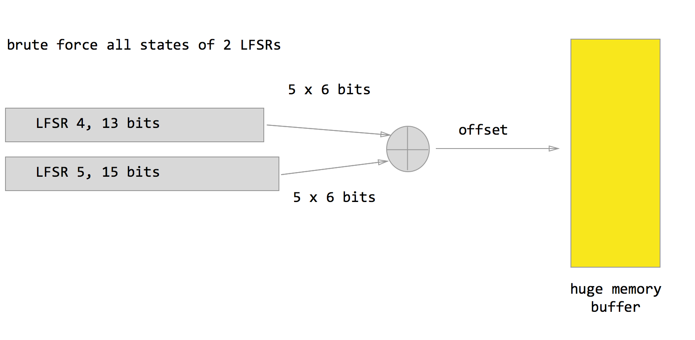
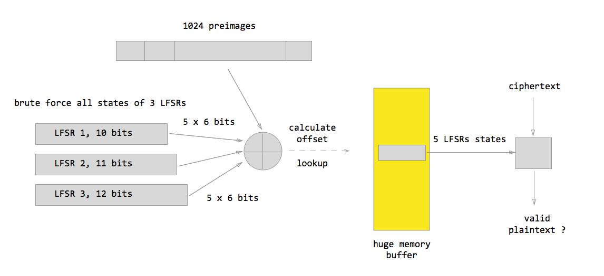
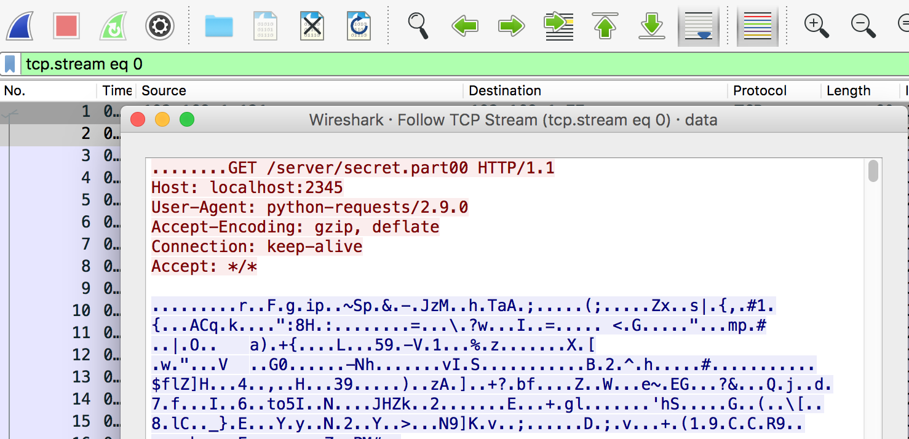
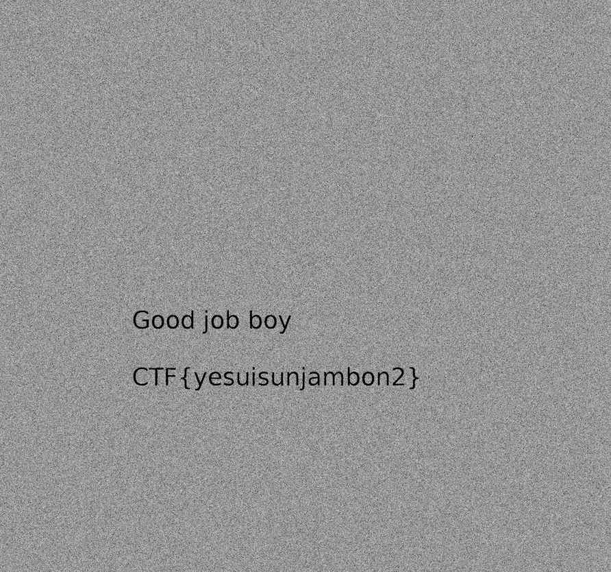

# tl;dr:

Use Meet-in-the-Middle technique to crack the scheme (approx. O(2^40) instead of O(2^60) full brute force). Plaintext starts with HTTP headers, so use this information to recover the LFSRs states and decrypt traffic.

# motivation

The task wasn't solved by anyone during the Google's CTF, it's from the homework part and costs 300 points - the most expensive in this cathegory. There has not been published any write up yet. 

As for me it's something unusual and challenging, not yet another Padding Oracle, length extension or weak RSA modulus, so that - worth solving ;)

# the challenge



You need to find the flag in the provided file.

# identify provided materials

```
$ file 47799aaf18a96cc17b3dd665d857a44921fb928f91b6fb2a54aaee6c28efaa8a
47799aaf18a96cc17b3dd665d857a44921fb928f91b6fb2a54aaee6c28efaa8a: xz compressed data
```

Having unpacked it we see some python code and a pcap file in the ```tmp``` directory. A brief look reveals that ```channel.py``` contains implementation of custom crypto algorithm ```KappaCrypto```, an encrypted tunnel inside TCP and the use of SimpleHTTPServer. All the scheme is depicted below.



# the tunnel (channel)

The piece of code 
```
if is_server:
      print("[~] Kappa server...")
      self.send_cr = KappaCrypto(key)
      self.recv_cr = NoCrypto()
    else:
      print("[~] Kappa client...")
      self.send_cr = NoCrypto()
      self.recv_cr = KappaCrypto(key)
    self.from_server=open('/tmp/from_service{}'.format(is_server), 'wb')
```
in the ```KappaChannel``` class constructor gives us a clue that data are encrypted only when it's being transmitted from server to client. The overall chanell works as follows:

1. An HTTP request is transmitted from a client to the server, the request is in plaintext
2. An instance of TCP server forwards the request to an instance of SimpleHTTP server
3. The instance of SimpleHTTP server serves the request and respondes with a file to the TCP server.
4. The TCP server encrypts the data, appends a special header and forwards it to the client.

The only crucial thing we should note in this place is that we actually know first bytes of underlying plaintext, because SimpleHTTP server adds a standard HTTP reader to every response. This observation will be used later in our cryptanilisys.

# the crypto algorithm

As I said, the algorithm is implemented in the ```KappaCrypto``` class. The algorithm consists of 5 LFSRs acting in [Galois mode](http://www.newwaveinstruments.com/resources/articles/m_sequence_linear_feedback_shift_register_lfsr.htm). 

```
class LFSR:

  def __init__(self, coeffs, n, state=1):
    poly = 0
    for j in coeffs:
      poly |= 1 << j
    self.coeffs = coeffs
    self.poly = poly
    self.n = n
    self.state = state

  def next(self):
    b = self.state >> (self.n - 1)
    self.state = self.state << 1
    assert b == 0 or b == 1
    if b:
      self.state ^= self.poly
    return b
```

All the five LFSRs have length ```[10, 11, 12, 13, 14]``` and are compbined at ```MultiLFSR``` class. So, overall the keyspace contains 2^60 keys - quite a big value for an usual PC.

A piece of code from ```MultiLFSR``` class:
```
def next(self):
    if len(self.q) == 0:
      v = 0
      for j in range(self.sbox.nbit_in):
        u=0
        for lfsr in self.lfsrs:
          u ^= lfsr.next()
        v|=u<<j
      v = self.sbox.get(v)
      for i in range(self.sbox.nbit_out):
        self.q.append(v >> i & 1)

    res = self.q[0]
    self.q = self.q[1:]
    return res
```

As we can see, at each tick every register produces a bit of keystream, all the bits are xored together and combined into tuples of six. Every tuple of six is processed by ```Sbox``` - six to four mapping and the result is four bits of keystream of the scheme. This scheme is depicted below.



# analysis

After a brief look we have some points to attack the scheme:

1. Examine the period of each LFSR - there can be short periods in them and we can use some keyless technique to recover the plaintext. We also can try to find minimal polynomials of the LFSRs and try to make an equivalent scheme but with smaller keyspace.
2. There might be something wrong with six-to-four mapping ```Sbox``` (for example, it's highly unballanced etc.) and we can use some keyless methods. 
2. Use bruteforce to find out the key
3. Use some kind of optimized brute force to recover the key.

Having spent some time playing with [sage](http://sagemath.org), I decided to dwell on point 3 and 4.

## dummy brute force 

Seems to be the most obvious way though it's far from optimal. I decided just to measure the time my server needs to recover the key and it's turned out that it's more than several years.

So, we can't attack the scheme directly because the brute force speed isn't enough.

## can we do better?

tl;dr: yes, we can. We'll exploit the fact that all outputs of LFSRs are XORed together, so it gives us some room for so called meet-in-the-middle attack.

# optimized brute force - MITM technique

We'll carry out our attack in the following two steps.

## meet-in-the-middle, step 1



Brute force the states of two 13 and 14 bits registers ( O(2^27) ), get the 30 bits of output in each iteration, combine them into ```uint32_t``` and store the intial states in the array by that ```uint32_t``` offset.  

## meet-in-the-middle, step 2



Brute force the states of three 10, 11, 12 bits registers, produce 30 bits of output, XOR it with each of "preimage" guesses and look up the value in the array from step 1. If there is a match, use 5 states to produce some keystream, decrypt the ciphertext and verify if it's an HTTP header.

The first step is quite simple, but at the second step we should use "preimages". Recall that the output from ```MultiLFSR``` comes to six-to-four mapping called ```SBox```. The mapping isn't one-to-one, each image (output) has four "preimages" (corresponding inputs), so we need to take them into consideration too. Thus, we take 5 4-bits values of the recovered keystream, and produce a set of 1024 possible preimage tuples, so each iteration at the second step takes 1024 guesses of a correct preimage.

The overall complexity of the method is approximately O(2^43) - something that can be practically achieved.

# implementation

## preparing the data

Just open ```data.pcap.cleaned``` file in Wireshark, apply ```tcp.stream eq 0``` filter to dissect the first TCP stream, then follow this stream, and save the data in raw format. Then strip the HTTP request and some ```KappaMsg``` headers (this can be done using ```edata.py``` script) and do this for every stream from 0 to 19.



## mitm step 1 notes

Just do as described earlier. The only thing we should bear in mind is there can be collisions in the array, so we need to store an address of the next element. I used the following structure for the array:

```
struct st_state
{
    uint16_t reg4;
    uint16_t reg5;
    struct st_state* next;
};
```

The structure contains address of the next possible struct and this field will be filled in case of collision. This step is implemented in the ```mitm_phase_1``` function and it takes less than two minutes to generate the array using only one thread.

## mitm stem 2 notes

This step is implemented in the ```mitm_phase_2``` function. To make things a bit faster I created several threads for this step. At this step things are done as described earlier - every iteration leads to 1024 trials because we need to brute force possible "preimages". 

# benchmarks

To carry out the attack I used a two CPU server, each CPU has 8 cores, ```cat /proc/cpuinfo``` shows 32 CPUs (Hyper-Threding is enabled). I decided to use 32 threads (Hyper-Threading adds approximately 5% comaring with 16 threads).

So, step two speed was about 1200 iterations (each includes that 1024 preimages guesses) per second. The total process took about 3 days to reveal the LFSRs states.

# decryption 

The solution is ```[309, 2008, 510, 7942, 5369]``` - intial states of all LFSRs.

Decryption revealed that it was a big PNG file. Having stripped HTTP response headers and combined the chunks of PNG into one file, I got an image with the flag (result.png).



# conclusions

1. don't invent your own crypto at least this way :)
2. the solution consumes some computational power, so next time you have to prepare a bunch of servers or aws instances in advance
3. in my solution I didn't use information about particular version of python. May be the authors have another solution :)

# questions

If you have question - just open an issue in the repository.
